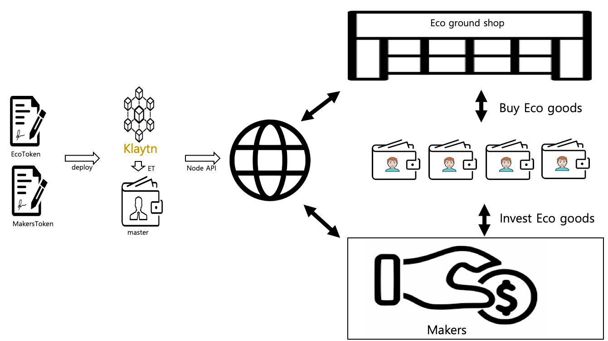
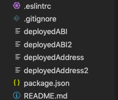
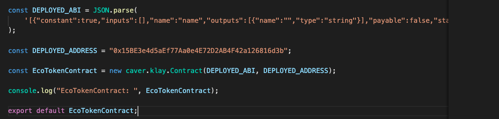
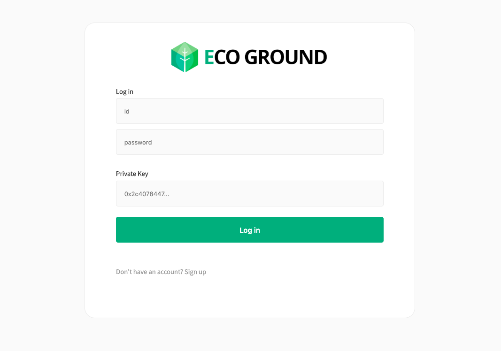
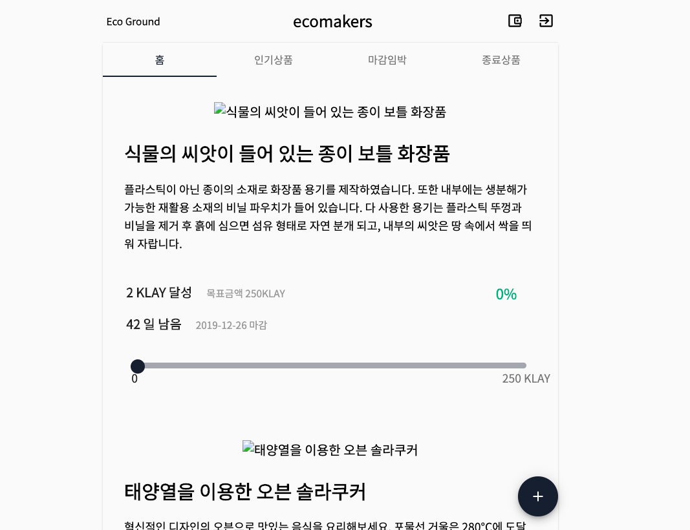

# Introduction 
This service is a green product platform based on klaytn. klaytn is pulic blockChain made Kakao subsidiary Gound X. The web framework uses React, not the final project. but The UI work that links the smart contract to it is complete.
   
# Klaytn Network 
   

Makers made ERC721 tokens and Eco Token made ERC20 tocons. If you do economic activity on this service, the eco power Token using ERC20 are sended by master address. These tokens can be used as a token of environmental contribution and mileage. Makers utilize smart contracts, and if the target klay is not reached or the period is over, the klay will be automatically refunded.

  

# Requirement 

- OS : MAC  
-> The reason why use mac os is that other os is incompatible react using webpack and redux.

# How to start (command)  

First, git clone and command like this.   

- truffle migrate --compile-all --reset --network klaytn    
It is a command to deploy to klaytn network. Then, Four file is update. (deployedABI, deployedABI2, deployedAddress, deployedAddress2). The files are used to connect klaytn network. So we must match the contents of each files where klaytn/MakersContract.js.  

   
This picture is the result of the command.  
   
So the contents of results are written like this. Why copy and write is that our member using window OS doesn't use webpack. so It is impossible that call smart contract functions using webpack. 
- yarn install  
- yarn start  

This command is how to start server.

   

Because of Demo version, Id's values and Password's valuse are possible using every values. Next part, You can only access the address baobab network address. You can get the address in baobab.net.  

   

The feeds are made by ERC721. but picture is not working because of unconnect S3_address.   

# Connect
If you have a question, send email to tkdlqm2@likelion.org. 
